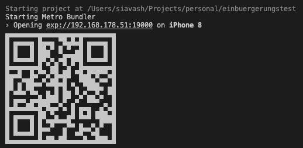

# Einbuergerungstest
Einbürgerungstest is an application that simulate German Citizenship Examination.

### How to run
First install dependecies:
```
   npm i
```
OR
```
   yarn install
```

Then you can run the app. The below command is for iOs:
```
npm run ios
```
To run app for andoird:
```
npm run android
```
You can also execute the app on web launcher via:
```
npm run web
```

You can see the app on a simulator or scan the QR and test it with your real mobile device.




### Upcoing fetaure
- Determine correct/incorrects items
- Change items based on random and sequential order
- Remember user progress
- Show users' progress with diagrams & statistics
- keep list of mistakes in a separate view
- Ability to Review mistakes
### Expo
> Why do I have a folder named ".expo" in my project?
The ".expo" folder is created when an Expo project is started using "expo start" command.
> What do the files contain?
- "devices.json": contains information about devices that have recently opened this project. This is used to populate the "Development sessions" list in your development builds.
- "settings.json": contains the server configuration that is used to serve the application manifest.
> Should I commit the ".expo" folder?
No, you should not share the ".expo" folder. It does not contain any information that is relevant for other developers working on the project, it is specific to your machine.
Upon project creation, the ".expo" folder is already added to your ".gitignore" file.


📫 How to reach me:

[](https://twitter.com/siaexplains)

